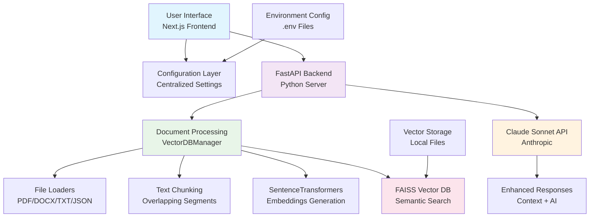

# FileIQ - Multi-Step Document Q&A Web Application

A sophisticated document analysis system that enables users to upload documents, generate vector embeddings, and perform intelligent Q&A using Claude Sonnet AI. Built with Next.js, FastAPI, and advanced vector search capabilities.

## 🚀 Features

### Core Functionality
- **📁 Multi-Format Document Support**: PDF, DOCX, TXT, and JSON files
- **🔍 Intelligent Vector Search**: FAISS-powered semantic search with relevance scoring
- **🤖 AI-Powered Q&A**: Claude Sonnet integration for contextual answers
- **⚡ Smart Vector Management**: Automatic detection of existing vectors to avoid re-processing
- **📊 Real-Time Progress Tracking**: Terminal-style progress modals with per-document status

### Advanced Features
- **🔄 Vector Refresh System**: Rebuild all document vectors with progress visualization
- **🗑️ Vector Management**: Delete vectors and disable Q&A when no vectors exist
- **🎯 Source Attribution**: Detailed source references with relevance scores
- **🛡️ Error Handling**: Comprehensive error handling with user-friendly messages
- **⚙️ Configuration Management**: Centralized config system for easy deployment

## 🏗️ High-Level Architecture



## 🔄 Application Flow

### 1. Document Upload & Processing
```
User Selects Folder → File Validation → Upload to Backend → Vector Check → 
Generate/Skip Vectors → Store in FAISS → Update UI
```

### 2. Q&A Process
```
User Question → Vector Search → Context Retrieval → Claude API → 
Enhanced Response → Source Attribution → Display Results
```

### 3. Admin Operations
```
Refresh: Scan Files → Delete Old Vectors → Regenerate → Update Storage
Delete: Remove All Vectors → Disable Q&A → Clear State
Restart: Reset UI State → Return to Initial Step
```

## 📂 Project Structure

```
FileIQ/
├── src/
│   ├── app/
│   │   ├── page.tsx                 # Main application component
│   │   ├── components/
│   │   │   └── TerminalProgressModal.tsx  # Progress visualization
│   │   ├── layout.tsx               # App layout
│   │   └── globals.css              # Global styles
│   ├── components/
│   │   ├── ui/                      # Shadcn/ui components
│   │   └── layout/                  # Header/Footer components
│   ├── config/
│   │   └── config.ts                # Centralized configuration
│   ├── hooks/                       # Custom React hooks
│   └── lib/                         # Utility functions
├── backend/
│   ├── fastapi_server.py            # FastAPI server & endpoints
│   ├── generate_document_vectors.py # Vector processing engine
│   ├── documents/                   # Uploaded documents storage
│   └── .env                         # Backend environment variables
├── .env.local                       # Frontend environment variables
└── README.md                        # This file
```

## 🛠️ Technology Stack

### Frontend
- **Framework**: Next.js 15 with TypeScript
- **UI Library**: Shadcn/ui components with Tailwind CSS
- **State Management**: React hooks (useState, useEffect)
- **Build Tool**: Turbopack for fast development

### Backend
- **API Framework**: FastAPI with automatic OpenAPI documentation
- **Vector Processing**: SentenceTransformers + FAISS
- **Document Processing**: PyPDF2, python-docx for file parsing
- **AI Integration**: Anthropic Claude Sonnet API
- **Environment**: Python with virtual environment

### Core Libraries
- **Vector Search**: FAISS (Facebook AI Similarity Search)
- **Embeddings**: SentenceTransformers (`all-MiniLM-L6-v2`)
- **AI Model**: Claude 3.5 Haiku (Anthropic)
- **File Processing**: PyPDF2, python-docx, JSON parsing

## ⚙️ Configuration

### Environment Variables
```bash
# Frontend (.env.local)
NEXT_PUBLIC_API_BASE_URL=http://localhost:8001

# Backend (backend/.env)
ANTHROPIC_API_KEY=your_anthropic_api_key_here
```

### Configurable Settings
All application settings are centralized in `src/config/config.ts`:
- API endpoints and base URLs
- File processing limits and timeouts
- Vector database parameters
- UI timing and behavior
- Supported file extensions

## 🚀 Getting Started

### Prerequisites
- Node.js 18+ and npm
- Python 3.8+ with pip
- Anthropic API key

### Installation

1. **Clone the repository**
```bash
git clone <repository-url>
cd FileIQ
```

2. **Setup Frontend**
```bash
npm install
cp .env.local.example .env.local
# Edit .env.local with your API base URL
```

3. **Setup Backend**
```bash
cd backend
python -m venv venv
source venv/bin/activate  # On Windows: venv\Scripts\activate
pip install fastapi uvicorn anthropic sentence-transformers faiss-cpu PyPDF2 python-docx python-dotenv
cp .env.example .env
# Edit .env with your Anthropic API key
```

### Running the Application

1. **Start Backend Server**
```bash
cd backend
source venv/bin/activate
python fastapi_server.py
# Server runs on http://localhost:8001
```

2. **Start Frontend Server**
```bash
npm run dev
# App available at http://localhost:3000
```

## 📋 Usage Guide

### Step 1: Document Upload
1. Click "Load Documents" to select a folder
2. Review and select documents to process
3. Click "Process Documents & Generate Vectors"
4. Monitor progress in the terminal-style modal

### Step 2: Ask Questions
1. Enter your question in the text area
2. Click "Get Answer" to receive AI-powered responses
3. Review source attributions and relevance scores

### Step 3: Admin Operations
- **Refresh Vectors**: Rebuild all vectors with latest processing
- **Delete Vectors**: Remove all vectors (disables Q&A)
- **Restart App**: Reset to initial state

## 🔧 API Endpoints

### Document Processing
- `POST /upload-and-generate-vectors` - Upload and process single file
- `POST /generate-vectors` - Generate vectors for existing file
- `POST /refresh-all-vectors` - Rebuild all document vectors
- `POST /delete-all-vectors` - Remove all vector databases

### Q&A System
- `POST /ask-question` - Submit question and get AI response

## 🎯 Key Features Explained

### Smart Vector Management
- Automatically detects existing vectors to avoid reprocessing
- Shows "Already vectorized" status for existing documents
- Provides option to refresh vectors when needed

### Progress Visualization
- Terminal-style progress modal with real-time updates
- Per-document status tracking (pending → processing → done/error/skipped)
- Detailed progress messages for each processing stage

### Intelligent Q&A
- Semantic search across all document vectors
- Contextual responses using Claude Sonnet
- Source attribution with relevance scores
- Fallback to general knowledge when no context found

### Error Handling
- Comprehensive error handling at all levels
- User-friendly error messages and recovery options
- Graceful degradation when services are unavailable

## 🤝 Contributing

1. Fork the repository
2. Create a feature branch (`git checkout -b feature/amazing-feature`)
3. Commit your changes (`git commit -m 'Add amazing feature'`)
4. Push to the branch (`git push origin feature/amazing-feature`)
5. Open a Pull Request

## 📄 License

This project is licensed under the MIT License - see the LICENSE file for details.

## 🙏 Acknowledgments

- [Anthropic](https://anthropic.com) for Claude AI
- [Hugging Face](https://huggingface.co) for SentenceTransformers
- [Facebook Research](https://github.com/facebookresearch/faiss) for FAISS
- [Shadcn/ui](https://ui.shadcn.com) for beautiful UI components

---

**Built with ❤️ using Next.js, FastAPI, and Claude AI**
